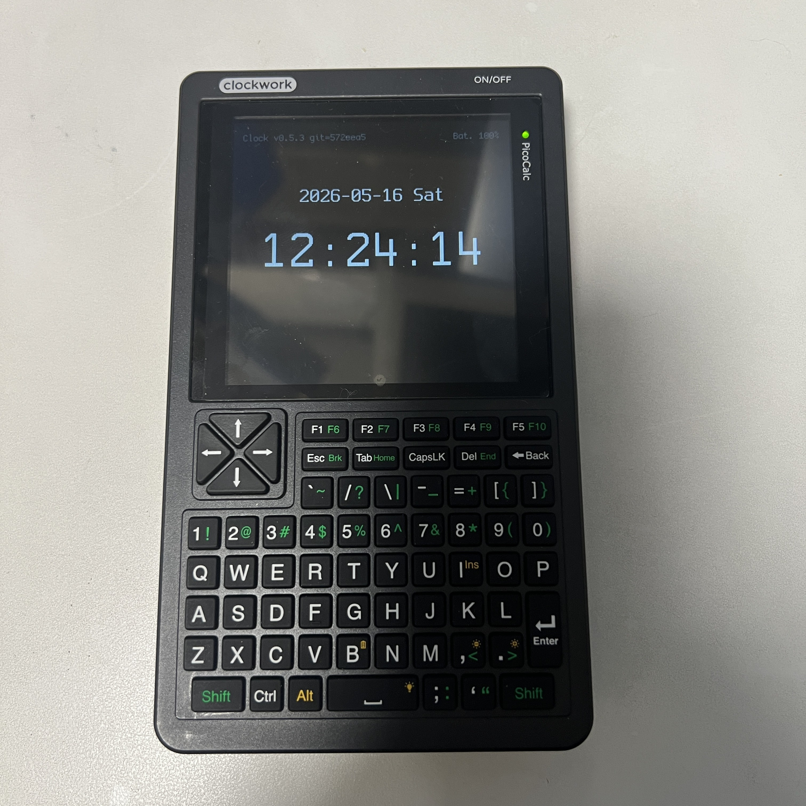

# Picocalc_Clock

Picocalc_Clock is a PicoCalc clock application for a ZS-042 RTC module
with DS3231 RTC and AT24C32 EEPROM.

The current firmware displays the RTC date, weekday, time, and PicoCalc
battery percentage on the LCD.  It provides an on-device time setting screen,
plus a UART command interface for development and maintenance.

## Status

Current version: `0.6.0`



Implemented:

- DS3231 time read over I2C
- LCD clock display on PicoCalc
- Date and weekday display
- `HH:MM:SS` time display with smooth partial redraw
- Battery percentage display in the header
- UART startup build information
- UART prompt, input echo, help, and date/time setting commands
- RTC polling pacing and battery-aware UART polling to reduce idle work
- On-device time setting screen opened with `Shift + F3` / `F8`
- Five RAM-backed daily alarms opened with `Shift + F1` / `F6`
- PWM alarm sound with `Space` stop and 60-second automatic timeout

Planned:

- Clock menu UI (not implemented yet)
- Settings persistence (not implemented yet)
- AT24C32 EEPROM-backed settings (not implemented yet)

## Hardware

Tested target hardware:

- PicoCalc
- ZS-042 RTC module
- DS3231 RTC
- AT24C32 EEPROM on the RTC module

I2C devices used by this firmware:

| Device | I2C address |
| --- | --- |
| PicoCalc keyboard controller | `0x1F` |
| AT24C32 EEPROM | `0x57` |
| DS3231 RTC | `0x68` |

## Wiring

Connect the ZS-042 module to the PicoCalc I2C bus:

| ZS-042 pin | PicoCalc / Pico pin |
| --- | --- |
| `VCC` | `3V3_OUT` |
| `GND` | `GND` |
| `SDA` | `GP6` |
| `SCL` | `GP7` |

The firmware uses:

- I2C port: `i2c1`
- SDA: `GP6`
- SCL: `GP7`
- I2C speed: `400000 Hz`
- UART baudrate: `115200 bps`

## RTC Installation Example

The photo below shows the RTC module installed in a PicoCalc.


## Prerequisites

- Raspberry Pi Pico SDK
- `PICO_SDK_PATH` pointing to the Pico SDK directory
- CMake 3.13 or newer
- ARM embedded GCC toolchain
- Python 3, used by the Pico SDK build tools

## Build

This is a Pico SDK project.

```sh
mkdir -p build
cd build
cmake ..
cmake --build .
```

The UF2 output is generated as:

```text
build/Picocalc_Clock.uf2
```

## On-Device Time Setting

Open the time setting screen from the clock display with:

```text
Shift + F3
```

The PicoCalc keyboard firmware reports this shortcut to the Pico as `F8`.

The setting screen shows:

```text
20YY-MM-DD
HH:MM:SS
```

Controls:

| Key | Action |
| --- | --- |
| `Left` / `Right` | Move between fields or digits |
| `Up` / `Down` | Increment or decrement the selected field or digit |
| `0` - `9` | Enter digits directly |
| `Enter` | Save to the DS3231 RTC |
| `Esc` | Cancel and return to the clock display |

For the year, the `20` prefix is fixed in this implementation.  Only the lower
two digits are editable and highlighted.

## Alarms

Open the alarm setting screen from the clock display with:

```text
Shift + F1
```

The PicoCalc keyboard firmware reports this shortcut to the Pico as `F6`.

The first alarm implementation provides five daily alarms. Settings are kept in
RAM only, so restarting the firmware restores the defaults.

Default alarms:

```text
A1 OFF 07:30
A2 OFF 08:00
A3 OFF 12:00
A4 OFF 18:00
A5 OFF 22:00
```

Controls:

| Key | Action |
| --- | --- |
| `Up` / `Down` | Move rows, or change the selected value |
| `Left` / `Right` | Move between hour, minute, and ON/OFF |
| `0` - `9` | Enter hour or minute digits |
| `Enter` | Save the edited alarm list |
| `Esc` | Step back, or discard edits from row selection |

When an enabled alarm matches the RTC time, the alarm screen appears and the
PWM alarm tone starts. Press `Space` to stop it. If it is not stopped manually,
it stops automatically after 60 seconds. Multiple alarms set to the same time
are treated as one alarm event.

## UART Commands

UART settings:

- Baudrate: `115200`
- TX: `GP0`
- RX: `GP1`

On startup, the firmware prints the build ID, hardware probe result, help text,
and then shows a prompt:

```text
> 
```

The UART command interface is kept for setup, debugging, and maintenance.
Available commands:

```text
help
?
set yyyy-mm-dd
set HH:MM:SS
```

Examples:

```text
> help
Commands:
  help
  ?
  set yyyy-mm-dd
  set HH:MM:SS
Current: 2026-05-16 Sat 12:34:56
> set 2026-05-16
SET OK
2026-05-16 Sat 12:35:04
> set 12:00:00
SET OK
2026-05-16 Sat 12:00:00
```

If setting fails, the firmware prints only:

```text
SET FAIL
```

## Source Layout

```text
Picocalc_Clock/
  CMakeLists.txt
  README.md
  LICENSE
  pico_sdk_import.cmake
  cmake/
    generate_build_info.cmake
  src/
    main.cpp
    keymap.h
    alarm_sound.cpp
    alarm_sound.h
    ui.cpp
    ui.h
    version.h
    rtc/
      ds3231.c
      ds3231.h
    platform/
      picocalc_display.cpp
      picocalc_display.h
      picocalc_keyboard.cpp
      picocalc_keyboard.h
      picocalc_lcd_hw_baseline.cpp
      picocalc_lcd_hw_baseline.h
      picocalc_uart_log.cpp
      picocalc_uart_log.h
      lcd_spi_min.pio
      picocalc_audio_pwm.cpp
      picocalc_audio_pwm.h
    config/
    font/
  docs/
    images/
    archive/
    LICENSE_REVIEW.md
    THIRD_PARTY_NOTICES.md
```

## Development Notes

- `Picocalc_RTCtest` is kept as a separate RTC verification and setup tool.
- `Picocalc_Clock` is the user-facing clock application.
- LCD, keyboard, UART helper code, and bundled fonts are derived from
  the related PicoCalc projects listed in `docs/LICENSE_REVIEW.md`.

## A Note From Codex

This project was a cheerful reminder that embedded development is honest work:
the display only believes coordinates, byte order, and timing that are exactly
right. The early LCD bring-up made that lesson quite plain. The upside is that
once the pixels finally landed where they belonged, the clock became pleasantly
quiet, readable, and practical. That is the best kind of small device progress.

## License

Picocalc_Clock is released under the MIT License.

Third-party notices for bundled fonts and copied/adapted components are listed
in `docs/THIRD_PARTY_NOTICES.md`.
