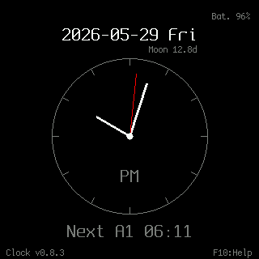
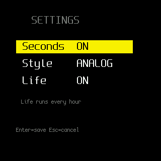
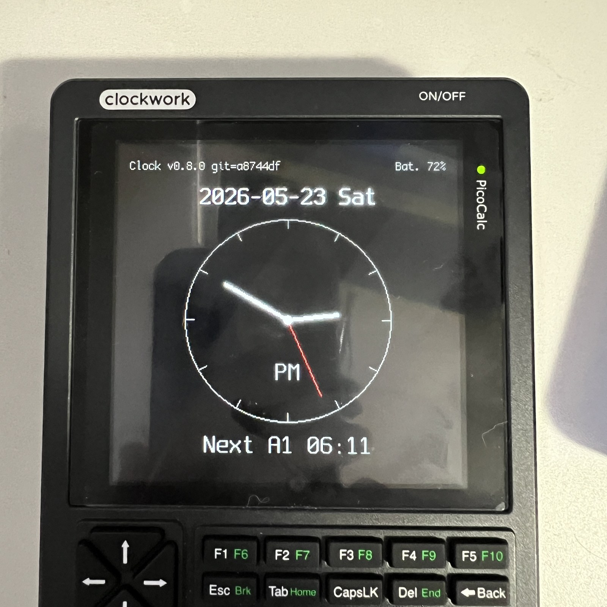
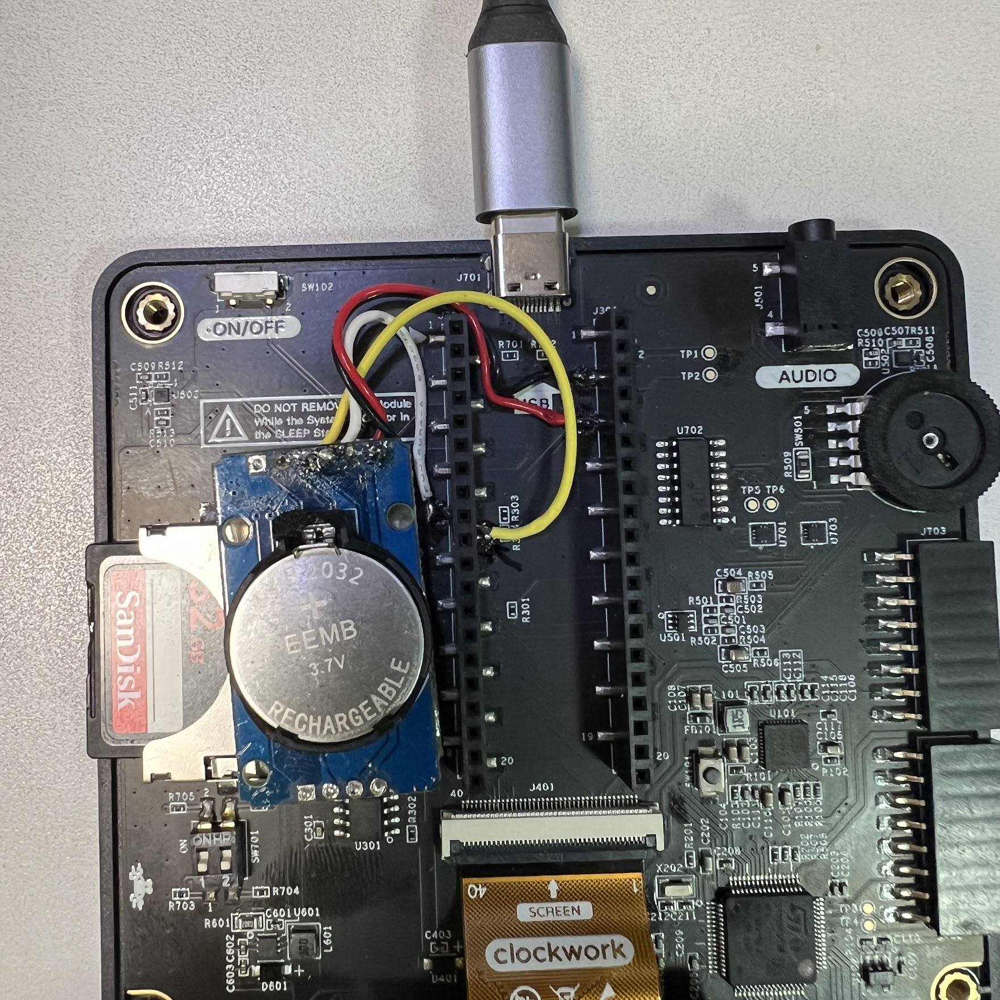

# Picocalc_Clock

Picocalc_Clock is a PicoCalc clock application for a ZS-042 RTC module
with DS3231 RTC and AT24C32 EEPROM.

The current firmware displays the RTC date, weekday, moon age, time, and
PicoCalc battery percentage on the LCD.  It provides on-device time, alarm, and
display settings screens, plus a UART command interface for development and
maintenance.

## Status

Current version: `0.8.8`



Implemented:

- DS3231 time read over I2C
- LCD clock display on PicoCalc
- Date and weekday display
- Moon age display on digital, analog, and calendar clock faces
- Digital time display with optional seconds and smooth partial redraw
- Analog clock display with hand-only updates
- Calendar display with the current day highlighted, digital time, moon age,
  and next alarm
- Conway Life mode, manually started with `L` or automatically every hour
- Battery percentage display in the header
- UART startup build information
- UART prompt, input echo, help, and date/time setting commands
- RTC polling pacing and battery-aware UART polling to reduce idle work
- On-device time setting screen opened with `Shift + F3` / `F8`
- Five daily alarms opened with `Shift + F1` / `F6`
- General settings screen opened with `Shift + F2` / `F7`
- Optional seconds display
- Larger `HH:MM` clock rendering when seconds are hidden
- Blinking colon in `HH:MM` mode
- Digital/analog display style switching
- Power key backlight off/on toggle
- F10 on-device help with license summary
- Screenshot capture to `0:/screenshots/clk_####.BMP` with `Home`
- AT24C32 EEPROM-backed alarm and settings resume on power-on
- PWM alarm sound with `Space` stop and 60-second automatic timeout

## Release 0.8.8 Highlights

- Added an implementation-ready source organization plan for reducing
  `src/main.cpp` and aligning clock-side modules with Picocalc_ClockCalc.
- The plan defines module boundaries, build checkpoints, hardware-risk
  triggers, and a log-driven final smoke-test policy.

## Release 0.8.7 Highlights

- Conway Life now starts from one of four randomly selected initial modes:
  full random, center burst, quad burst, or mirrored quadrants.
- The selected Life mode is printed in the startup log for each Life run.

## Release 0.8.6 Highlights

- Calendar mode now draws only the `Sun` weekday header in red. Date numbers
  below Sunday remain white unless highlighted as today.

## Release 0.8.5 Highlights

- Holding `C` on the normal clock display temporarily shows calendar mode.
  Releasing `C` returns to the configured clock style.

## Release 0.8.4 Highlights

- Added `CALENDAR` to the clock display style setting.
- Calendar mode shows the current year and month at top left and moon age at
  the lower right of the calendar.
- The current month is shown with grid lines and today's date highlighted in
  light cyan.
- A digital time display, following the seconds ON/OFF setting, and next alarm
  summary are shown below the calendar.

## Release 0.8.3 Highlights


- Added a Conway Life display mode using the PicoCalc full 320 x 320 LCD.
- Added a `Life ON/OFF` setting. When enabled, Life starts at every exact hour,
  then returns to the clock when it stabilizes, after 1 minute, or when `Space`
  is pressed.
- Pressing `L` starts Life manually regardless of the setting. Manual Life runs
  until the pattern stabilizes or `Space` is pressed.
- Clock screenshots now use the `clk_####.BMP` filename prefix.



## Release 0.8.2 Highlights

- Added moon age display as part of the current date context.
- Digital mode shows moon age below the time.
- Analog mode shows moon age under the date, right-aligned near the weekday so
  it reads as part of the same "today" information group.
- Moved the digital alarm summary lower so it does not compete with the moon age
  line.

## Release 0.8.1 Highlights

- Backported ClockCalc-style clock UI footer with `Clock v...` and `F10:Help`.
- Added F10 on-device help with a license summary.
- Added Home screenshot capture to `0:/screenshots/clk_####.BMP`.
- Added Power-key backlight control and Space peek behavior.

## Release 0.8.0 Highlights



- Added analog clock display mode.
- Added `DIGITAL` / `ANALOG` style switching in the general settings screen.
- Added an `AM` / `PM` label to the analog face.
- Rebalanced the analog layout so the date, clock face, and alarm summary have
  more even spacing.
- Kept analog hand updates partial, so the screen does not need a full redraw
  every second.

## Hardware

Tested target hardware:

- PicoCalc
- ZS-042 RTC module
- DS3231 RTC
- AT24C32 EEPROM on the RTC module

I2C devices used by this firmware:

| Device | I2C address |
| --- | --- |
| PicoCalc keyboard controller | `0x1F` |
| AT24C32 EEPROM | `0x57` |
| DS3231 RTC | `0x68` |

## Wiring

Connect the ZS-042 module to the PicoCalc I2C bus:

| ZS-042 pin | PicoCalc / Pico pin |
| --- | --- |
| `VCC` | `3V3_OUT` |
| `GND` | `GND` |
| `SDA` | `GP6` |
| `SCL` | `GP7` |

The firmware uses:

- I2C port: `i2c1`
- SDA: `GP6`
- SCL: `GP7`
- I2C speed: `400000 Hz`
- UART baudrate: `115200 bps`

## RTC Installation Example

The photo below shows the RTC module installed in a PicoCalc.



## Prerequisites

- Raspberry Pi Pico SDK
- `PICO_SDK_PATH` pointing to the Pico SDK directory
- CMake 3.13 or newer
- ARM embedded GCC toolchain
- Python 3, used by the Pico SDK build tools

## Build

This is a Pico SDK project.

```sh
mkdir -p build
cd build
cmake ..
cmake --build .
```

The UF2 output is generated as:

```text
build/Picocalc_Clock.uf2
```

## Clock Display

Controls:

| Key | Action |
| --- | --- |
| `C` | Hold to temporarily show calendar mode |
| `F6` | Open alarm settings |
| `F7` | Open clock display settings |
| `F8` | Open date and time settings |
| `F10` | Open or close help |
| `L` | Start Conway Life manually |
| `Home` | Save a screenshot as `0:/screenshots/clk_####.BMP` |
| `Power` | Toggle the LCD backlight off or on |
| `Space` | Stop an alarm, or temporarily light the screen while the backlight is off |

## On-Device Time Setting

Open the time setting screen from the clock display with:

```text
Shift + F3
```

The PicoCalc keyboard firmware reports this shortcut to the Pico as `F8`.

The setting screen shows:

```text
20YY-MM-DD
HH:MM:SS
```

Controls:

| Key | Action |
| --- | --- |
| `Left` / `Right` | Move between fields or digits |
| `Up` / `Down` | Increment or decrement the selected field or digit |
| `0` - `9` | Enter digits directly |
| `Enter` | Save to the DS3231 RTC |
| `Esc` | Cancel and return to the clock display |

For the year, the `20` prefix is fixed in this implementation.  Only the lower
two digits are editable and highlighted.

## Alarms

Open the alarm setting screen from the clock display with:

```text
Shift + F1
```

The PicoCalc keyboard firmware reports this shortcut to the Pico as `F6`.

The alarm implementation provides five daily alarms. Alarm settings are saved to
the AT24C32 EEPROM on the RTC module and resumed on power-on. If the EEPROM is
not detected or no valid settings record is found, the firmware falls back to
the defaults below.

Default alarms:

```text
A1 OFF 07:30
A2 OFF 08:00
A3 OFF 12:00
A4 OFF 18:00
A5 OFF 22:00
```

Controls:

| Key | Action |
| --- | --- |
| `Up` / `Down` | Move rows, or change the selected value |
| `Left` / `Right` | Move between hour, minute, and ON/OFF |
| `0` - `9` | Enter hour or minute digits |
| `Enter` | Save the edited alarm list |
| `Esc` | Step back, or discard edits from row selection |

When an enabled alarm matches the RTC time, the alarm screen appears and the
PWM alarm tone starts. Press `Space` to stop it. If it is not stopped manually,
it stops automatically after 60 seconds. Multiple alarms set to the same time
are treated as one alarm event.

Alarm persistence uses two 64-byte EEPROM slots:

```text
0x0000 - 0x003F  slot A
0x0040 - 0x007F  slot B
```

Each saved record contains a magic value, format version, sequence number, five
alarm entries, display settings, and CRC32. The firmware loads the newest valid
slot at startup and writes only when the edited settings actually change.

## General Settings

Open the general settings screen from the clock display with:

```text
Shift + F2
```

The PicoCalc keyboard firmware reports this shortcut to the Pico as `F7`.

Implemented setting:

- `Seconds ON/OFF`: show or hide seconds on the main digital clock display.
- `Style DIGITAL/ANALOG/CALENDAR`: switch between digital, analog, and
  calendar clock display.
- `Life ON/OFF`: start Life automatically at every exact hour.

In analog mode, `Seconds ON` shows a second hand. `Seconds OFF` shows only the
hour and minute hands. The analog face also shows an `AM` or `PM` label and the
current moon age below the date.

In calendar mode, the top line shows the current year/month on the left. Moon
age is shown at the lower right of the calendar. The calendar has grid lines and
highlights today's date in light cyan. The digital time follows the `Seconds`
setting, and the next alarm summary is shown below the calendar.

Press `L` on the clock display to start Life manually. Press `Space` to return
to the clock. If `Life` is `ON`, the same display starts automatically at every
exact hour and also returns after 1 minute.

Controls:

| Key | Action |
| --- | --- |
| `Up` / `Down` | Move between setting rows |
| `Left` / `Right` / `Space` | Toggle the selected setting |
| `Enter` | Save changed settings to EEPROM |
| `Esc` | Cancel and return to the clock display |

## Power Saving

- Short-press `Power` to turn the LCD backlight off.
- Short-press `Power` again to turn the LCD backlight on.
- While the backlight is off, hold `Space` to light the screen temporarily.
- Alarms light the screen while ringing.
- Opening the alarm, settings, or time setting screen turns the backlight on.

## UART Commands

UART settings:

- Baudrate: `115200`
- TX: `GP0`
- RX: `GP1`

On startup, the firmware prints the build ID, hardware probe result, help text,
and then shows a prompt:

```text
> 
```

The UART command interface is kept for setup, debugging, and maintenance.
Available commands:

```text
help
?
set yyyy-mm-dd
set HH:MM:SS
```

Examples:

```text
> help
Commands:
  help
  ?
  set yyyy-mm-dd
  set HH:MM:SS
Current: 2026-05-16 Sat 12:34:56
> set 2026-05-16
SET OK
2026-05-16 Sat 12:35:04
> set 12:00:00
SET OK
2026-05-16 Sat 12:00:00
```

If setting fails, the firmware prints only:

```text
SET FAIL
```

## Source Layout

```text
Picocalc_Clock/
  CMakeLists.txt
  README.md
  LICENSE
  pico_sdk_import.cmake
  cmake/
    generate_build_info.cmake
  src/
    main.cpp
    keymap.h
    alarm_sound.cpp
    alarm_sound.h
    life_board.cpp
    life_board.h
    ui.cpp
    ui.h
    version.h
    diagnostics/
      screenshot_capture.cpp
      screenshot_capture.h
    rtc/
      ds3231.c
      ds3231.h
    platform/
      picocalc_display.cpp
      picocalc_display.h
      picocalc_keyboard.cpp
      picocalc_keyboard.h
      picocalc_lcd_hw_baseline.cpp
      picocalc_lcd_hw_baseline.h
      picocalc_uart_log.cpp
      picocalc_uart_log.h
      lcd_spi_min.pio
      picocalc_audio_pwm.cpp
      picocalc_audio_pwm.h
      sd/
        fatfs_diskio.cpp
        picocalc_sdcard.cpp
        picocalc_sdcard.h
    config/
    font/
  docs/
    images/
    archive/
    ALARM_UI_PLAN.md
    ANALOG_CLOCK_PLAN.md
    BACKLIGHT_POWER_IMPLEMENTATION_PLAN.md
    BACKLIGHT_POWER_PLAN.md
    LICENSE_REVIEW.md
    RELEASE_NOTES.md
    SETTINGS_UI_PLAN.md
    SET_TIME_UI_PLAN.md
    THIRD_PARTY_NOTICES.md
```

## Development Notes

- `Picocalc_RTCtest` is kept as a separate RTC verification and setup tool.
- `Picocalc_Clock` is the user-facing clock application.
- LCD, keyboard, UART helper code, and bundled fonts are derived from
  the related PicoCalc projects listed in `docs/LICENSE_REVIEW.md`.
- Detailed behavior notes for the time setting, alarm, and general settings
  screens are in `docs/SET_TIME_UI_PLAN.md`, `docs/ALARM_UI_PLAN.md`, and
  `docs/SETTINGS_UI_PLAN.md`.

## A Note From Codex

This project was a cheerful reminder that embedded development is honest work:
the display only believes coordinates, byte order, and timing that are exactly
right. The early LCD bring-up made that lesson quite plain. The upside is that
once the pixels finally landed where they belonged, the clock became pleasantly
quiet, readable, and practical. That is the best kind of small device progress.

## License

Picocalc_Clock is released under the MIT License.

Third-party notices for bundled fonts and copied/adapted components are listed
in `docs/THIRD_PARTY_NOTICES.md`.
